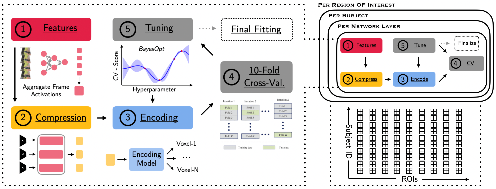

# Algonauts-2021 Challenge Solution



## Installation & Reproduction

Install all required dependencies (in a clean environment):
```
pip install -r requirements.txt
```

Generate activations from different neural network architectures (AlexNet, VGG, ResNets, VOneNetworks and SimCLR-v2):
```
cd feature_extraction
python generate_features.py
cd ../feature_compression
python run_compression.py
```

Run on Bayesian Optimization tuning (50 iterations) for Subject 1 and ROI V1 with AlexNet PCA-100 features and ElasticNet encoding:
```
python run_roi.py -config_fname configs/train/base_config.json
```

Running every single configuration sequentially can take a long time. We parallelize the general Encoding-10-Fold-CV-BayesOpt pipeline over subjects and ROIs. In order to do so efficiently we rely on the [`MLE-Toolbox`](https://github.com/RobertTLange/mle-toolbox). It provides a framework for logging and scheduling experiments on either Slurm, OpenGridEngine or Google Cloud Platform. A grid search over subjects and ROIs can then be launched via:

```
mle run configs/cluster/base_roi.yaml
```

## Visualizing The Results

```
jupyter lab notebooks/inspect_experiments.ipynb
```

## Notes and Questions:
- Need to upload result .pkl as .zip without subdirectories being zipped!
- Can get detailed results for all regions via `Download output from scoring step`
- Only using 5 ResNet layers, but there are many more. What resolution to pick?
- What sampling rate and temporal feature aggregation makes sense (weighted mean)?
- LOC encodes movement: Does it make sense to model differences in features?
- Different dim. reduction techniques (PCA dims/PWCCA)?
- What are repetitions? And what does this line of code do?
`ROI_data_train = np.mean(ROI_data["train"], axis = 1)`
- In `generate_features.py` all features are being averaged. Is this the correct thing to do? Or is there a smarter more fine-grained version
- Is this the time averaged signal? Can we use this as auxiliary tasks?
- How many voxels are there per ROI? Different across subjects?
- At what level can model share data? All subject core or all ROI core?
- What is the right sampling rate?
- Single layer vs full feature selection from all?
- What model fits best for which ROI and subject?
- How to combine features of different layers/networks?
- Finetune feature extractor on neural data
- What categories are in the train/test set?
    - ImageNet predictions/Manual
    - Fine-tuning on these?
- Shared Resnet core + Subject-specific + ROI-specific output heads
- FFW vs. LSTM and which level recurrence?
- Pretrained ViT: https://github.com/rwightman/pytorch-image-models/blob/master/timm/models/vision_transformer.py - how to get features
- Orthogonal Matching Pursuit: https://scikit-learn.org/stable/modules/generated/sklearn.linear_model.OrthogonalMatchingPursuit.html
